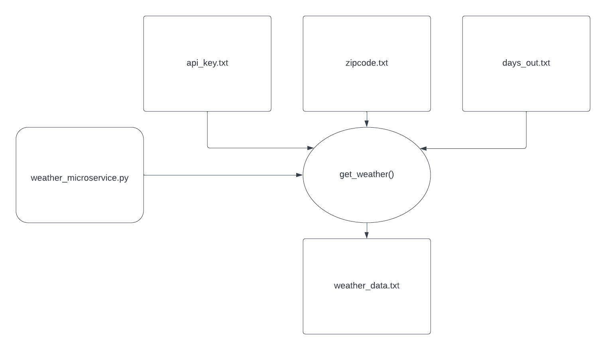

# CS 361 Microservice Communication Contract

My name is Benni Taylor and this repository holds the necessary code for my microservice for CS 361, my communication contract for my partner, and a UML diagram.

## Set-Up
The `weather_service.py` program is self-contained and uses data transfer via text files. The required files that need to be given by the user are `api_key.txt`, `zipcode.txt`, and `days_out.txt`. Samples of these files have been provided in this repository.

### api_key.txt
In order to run the program, you will need to obtain an API key from https://www.weatherapi.com/ by creating an account. Account creation and API usage is free. Once you have your API key, replace the text in the `api_key.txt` file with the API key, being careful not to leave any blank lines at the end of the file.

### zipcode.txt
The `zipcode.txt` file holds the user's query for what area they would like to receive weather information from. This can be done with a zip code or by providing a city/state search.

### days_out.txt
The API can retrieve weather data up to 10 days out from the current date. The `days_out.txt` file holds the user's query for how many days, up to 10, they want to view data.

## Requesting Data
To request data, run the `weather_service.py` program while having the three required .txt files in the same system folder. See example .txt files to understand what is necessary to make the call.

## Receiving Data
Once the `weather_service.py` program has successfully run, the JSON weather data for the given location and date range will be available in a `weather_data.txt` file for the user to use in whatever manner they see fit.

## UML Diagram

